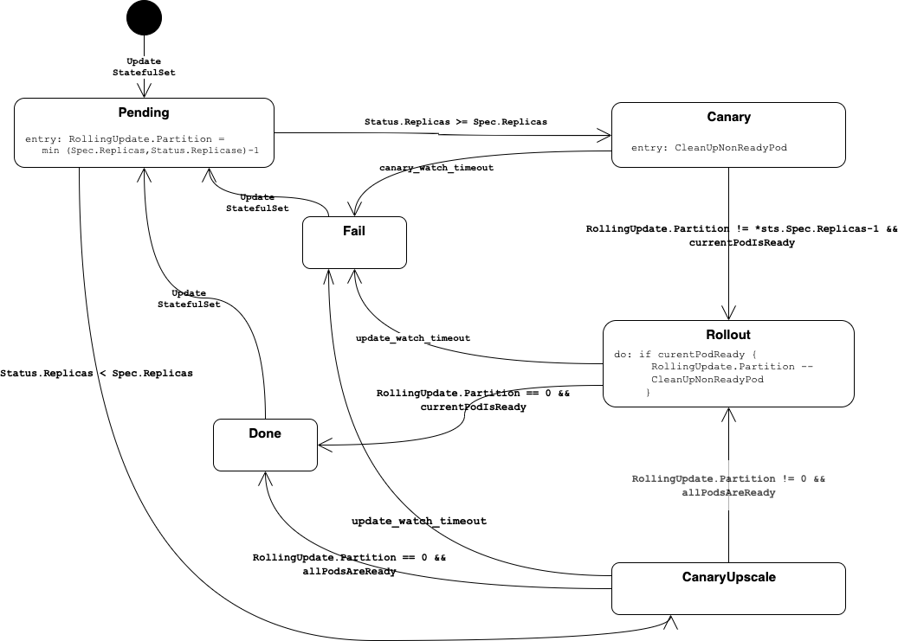

# StatefulSet Rollout

To implement the BOSH behaviour during rollout of a new manifest, an special controller is introduced.

It mitigates the problem of the standard kubernetes `StatefulSet` controller, which gets stuck if a pod fails during startup.

This controller implements the following state machine

