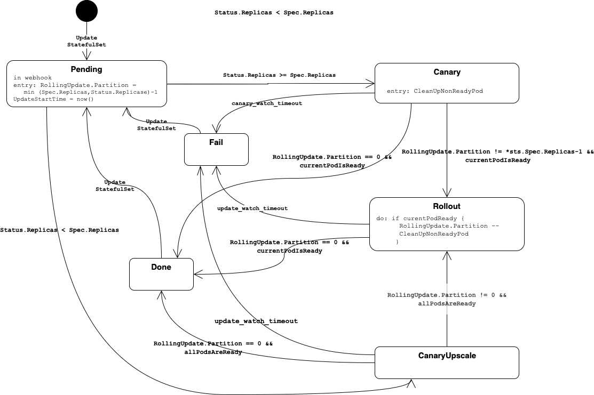

# StatefulSet Rollout

To implement the BOSH behaviour during rollout of a new manifest, an special controller is introduced.

It mitigates the problem of the standard kubernetes `StatefulSet` controller, which gets stuck if a pod fails during startup.

This controller implements the following state machine

### Known Limitations

#### CanaryUpscale 

During upscale, there is no real canary behaviour implemented. 
If a `StatefulSet` is scaled from 3 to 5 replicas, the state changes to `CanaryUpscale` and `Partition` is set to 2. 
The k8s statefulset controller creates the 2 missing instances. 
If all instances are ready the controller switches to state `Rollout` and continues as usual.
Due to the fact that more than 1 instance might be updated in state `CanaryUpscale`, the `update-watch-time` is used as timeout.
